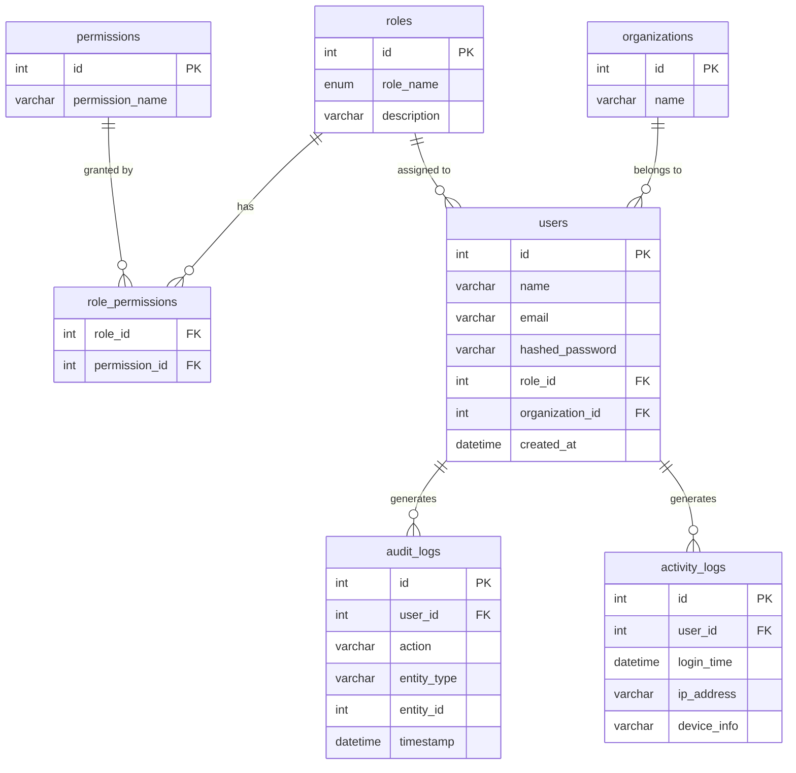

# AuthAxis

A full-stack web application for managing who inside a company can see and do what, built with a focus on security, clean architecture, and real-world access control patterns.

---

## Demo


---

## Screenshots

Landing Page 

Dashboard

User Management


---

## What This Project Demonstrates

Most companies store sensitive information like employee records, financial data, and internal documents in web applications. The problem is that not every employee should be able to see or change everything. A junior team member shouldn't be able to delete other users; a contractor shouldn't be able to see payroll data.

AuthAxis solves this by giving organizations a single dashboard where administrators can:

- Control exactly **who can log in** and verify their identity securely
- Define **roles** (Admin, Manager, Member, Viewer) and assign them to people
- Attach **specific permissions** to each role, so access is granted deliberately rather than by default
- See a **live audit trail** of every action taken in the system like who did what, and when
- Review **analytics** about login patterns and user activity over time

This isn't a tutorial-style auth demo. It's an implementation of the kind of access control system that real SaaS products need: JWT-based authentication with token rotation, a full permission layer checked on every request, and a database schema designed to support that cleanly.

---

## Key Features

| Feature | How it works under the hood |
|---|---|
| Secure login and registration | JWT access tokens (15-minute lifetime) paired with httpOnly refresh cookies (7 days). Passwords are hashed with bcrypt before being stored. |
| Role-based access control | Four roles (Admin, Manager, Member, Viewer) each mapped to a specific set of permissions in the database. Every protected API request checks the user's permissions before responding. |
| Live analytics charts | Three charts rendered with Recharts. User growth (area), role distribution (pie), and login activity (line) - backed by five analytics API endpoints. |
| Full audit trail | Every write action is logged with who did it, what they changed, and when. Logs are paginated and filterable by action type and date range. |
| User management | Admins can create, edit, and delete users, with each action gated by a specific permission rather than just a role check. |
| Token refresh without re-login | When an access token expires, the browser silently sends the refresh cookie and gets a new token. The user never sees a logout. |
| Profile management | Users can update their email and password. Password changes automatically send a security notification email via Nodemailer; delivery failures are logged but never block the response. |

---

## Tech Stack

### Frontend

| Technology | Why it was chosen |
|---|---|
| React 18 + TypeScript | TypeScript catches auth state bugs that are expensive to find at runtime. |
| Vite | Much faster than CRA; the dev proxy removes CORS friction during local development. |
| Tailwind CSS | Keeps styles co-located without the naming overhead of BEM or CSS Modules. |
| TanStack Query (React Query) | Manages caching, refetching, and the token refresh queue without a global state manager. |
| Recharts | React-native charts; no need for a heavier D3 wrapper. |

### Backend

| Technology | Why it was chosen |
|---|---|
| Node.js + Express + TypeScript | Minimal framework; TypeScript keeps request/response shapes consistent. |
| mysql2 (raw SQL, no ORM) | Full control over the joins and window functions the permission model requires. |
| Zod | Validates and strips unknown fields at the API boundary. |

### Database & Security

| Technology | Why it was chosen |
|---|---|
| MySQL 8.0 | Required for window functions and CTEs in the analytics queries. |
| bcrypt (12 rounds) | 12 rounds balances security with acceptable login latency. |
| helmet.js | Sets secure HTTP headers (CSP, X-Frame-Options, HSTS, etc.) with one line of middleware. |
| express-rate-limit | Auth endpoints are limited more aggressively than general API routes to slow down brute-force attempts. |

---

## Database Schema

<details>
<summary>Expand ER diagram</summary>



</details>

---

## Local Setup

These instructions assume you have **Node.js 18+** and **MySQL 8.0+** installed. Nothing else is required.

### Step 1 — Clone and install

```bash
git clone <repo-url>
cd secureWorkspaceDashboard

cd backend && npm install
cd ../frontend && npm install
```

### Step 2 — Configure environment variables

```bash
# From the project root
cp .env.example backend/.env
```

Open `backend/.env` and fill in your values. At minimum, set `DB_PASSWORD`, `JWT_SECRET`, and `JWT_REFRESH_SECRET`. Generate secrets with:

```bash
node -e "console.log(require('crypto').randomBytes(64).toString('hex'))"
```

Run twice, one value for `JWT_SECRET`, a different one for `JWT_REFRESH_SECRET`.

### Step 3 — Create and seed the database

```bash
# Create the database
mysql -u root -p -e "CREATE DATABASE workspace_db CHARACTER SET utf8mb4 COLLATE utf8mb4_unicode_ci;"

cd backend

# Create tables, seed roles/permissions/org, then seed 41 demo users (~30s)
npm run db:reset
```

Or run the steps individually:

```bash
mysql -u root -p workspace_db < src/db/migrations/001_schema.sql
mysql -u root -p workspace_db < src/db/seeds/seed.sql
npm run seed
```

### Step 4 — Start the application

```bash
# Terminal 1
cd backend && npm run dev   # http://localhost:3001

# Terminal 2
cd frontend && npm run dev  # http://localhost:5173
```

Navigate to [http://localhost:5173](http://localhost:5173) and click **Sign in**.

---

## Environment Variables

Copy `.env.example` to `backend/.env`. All variables below are required.

| Variable | Example value | What it's for |
|---|---|---|
| `PORT` | `3001` | The port the Express server listens on |
| `NODE_ENV` | `development` | Controls whether stack traces appear in error responses |
| `DB_HOST` | `localhost` | Hostname of your MySQL server |
| `DB_PORT` | `3306` | MySQL port (default is 3306) |
| `DB_USER` | `root` | MySQL username |
| `DB_PASSWORD` | `your_password` | MySQL password for the user above |
| `DB_NAME` | `workspace_db` | The database name |
| `JWT_SECRET` | _(64-char hex string)_ | Signs short-lived access tokens (15 min). Anyone with it can forge auth so keep it secret. |
| `JWT_REFRESH_SECRET` | _(different 64-char hex string)_ | Signs long-lived refresh tokens (7 days). Must differ from `JWT_SECRET`. |
| `FRONTEND_URL` | `http://localhost:5173` | The exact origin the backend will accept CORS requests from. No trailing slash. |
| `VITE_API_URL` | `http://localhost:3001/api` | API base URL used by the frontend. In production, set this in your Vercel project settings. |

---

## API Reference

### Auth

| Method | Endpoint | Auth required | Description |
|---|---|---|---|
| POST | `/api/auth/register` | None | Register a new user |
| POST | `/api/auth/login` | None | Log in; returns access token + sets refresh cookie |
| POST | `/api/auth/refresh` | Refresh cookie | Issue a new access token; rotates the refresh token |
| GET | `/api/auth/me` | Bearer token | Return the currently authenticated user |
| POST | `/api/auth/logout` | None | Clear the refresh cookie |

### Other routes

| Prefix | Permission model | Source |
|---|---|---|
| `/api/users` | Per-action: `view_users`, `create_users`, `edit_users`, `delete_users` | `routes/users.ts` |
| `/api/roles` | Read: authenticated · Write: `assign_roles` | `routes/roles.ts` |
| `/api/audit-logs` | `view_audit_logs` | `routes/auditLogs.ts` |
| `/api/analytics/*` | `view_analytics` | `routes/analytics.ts` |
| `/api/me` | Bearer token (any authenticated user) | `routes/profile.ts` |

---

## Test Credentials

```
┌─────────────────────────────────────────────────────────┐
│  Role     │  Email                         │  Password   │
├───────────┼────────────────────────────────┼─────────────┤
│  Admin    │  admin@example.com             │  password123│
│  Manager  │  morgan.matthews@example.com   │  password123│
│  Member   │  sam.foster@example.com        │  password123│
│  Viewer   │  viewer.addison@example.com    │  password123│
└─────────────────────────────────────────────────────────┘
```

The seed script creates **41 users total**: 1 admin · 5 managers · 15 members · 20 viewers.

---

## Deployment

### Backend — Railway

- Create a new project at [railway.app](https://railway.app), add your GitHub repo as a service, and set the root directory to `backend`
- Add a **MySQL** plugin. Railway auto-populates the `DB_*` variables
- Add `NODE_ENV=production`, `JWT_SECRET`, `JWT_REFRESH_SECRET`, and `FRONTEND_URL` manually
- Build command: `npm run build` · Start command: `npm start`
- After first deploy, open a Railway shell and run `npm run db:reset` to create tables and seed data

### Frontend — Vercel

- Import the repo at [vercel.com](https://vercel.com), set root directory to `frontend`, framework to `Vite`
- Add env var: `VITE_API_URL=https://your-railway-backend.railway.app/api`
- Deploy, then go back and update `FRONTEND_URL` in Railway to your Vercel URL and redeploy the backend

---

## Security Features

- **Passwords are never stored as readable text.** bcrypt runs a one-way hash before anything touches the database. A stolen database yields scrambled strings, not credentials.
- **Login sessions expire automatically.** Access tokens last 15 minutes. The browser silently rotates them using a refresh token in a secure cookie, limiting exposure if a token is ever intercepted.
- **Cookies are inaccessible to JavaScript.** The `httpOnly` flag means browser scripts, including anything injected by XSS, cannot read the refresh token.
- **The server only talks to one allowed origin.** CORS rejects requests from any domain other than the registered frontend URL.
- **Every protected request is checked twice.** Auth middleware first confirms the token is valid. A separate permissions middleware then checks whether the user's role grants the specific action they're attempting.
- **SQL injection is structurally prevented.** All queries use parameterized statements, no string interpolation anywhere in the query layer.
- **The API is hardened against automated attacks.** Rate limiting applies globally, with a tighter limit (10 req / 15 min) on auth endpoints specifically.
- **Input is validated at the boundary.** Zod schemas validate and strip unknown fields from every request body before it reaches the database.
- **Production errors reveal nothing.** The error middleware suppresses stack traces in production so failed requests don't leak file paths or library versions.

---

## What I Learned

**The dual-token strategy is messier than it looks in tutorials.** Implementing the refresh flow end to end was harder than expected, specifically queuing multiple concurrent 401s so only one refresh fires. The solution was holding pending requests in an array and replaying them after a single refresh completes.

**Writing raw SQL was the right call.** I chose it over Prisma to keep full control over the three-way joins and window functions the permission model needs. The tradeoff is verbosity, but it was worth it.

**React Query changed how I think about frontend architecture.** Its caching and invalidation model was a better fit than Redux or Context for server data. The key insight was that server state and UI state should be managed separately.

**Permission-checking at the route level vs. the query level is a real design decision.** This project checks in middleware before the route handler runs. An alternative is filtering inside the query itself for row-level security. Middleware works here because access is coarse-grained: you either have a permission or you don't.

---

## Roadmap

1. **OAuth / SSO login** — Add Google and GitHub login via OAuth 2.0 so teams don't need to manage separate passwords.
2. **End-to-end test suite** — Playwright tests covering the core auth flows so regressions are caught before deploy.
3. **Docker Compose dev environment** — A single `docker compose up` so new contributors don't need to configure a local MySQL instance.
4. **Email verification on registration** — Users are currently active immediately after signup; a verification step would bring the flow in line with production standards.
